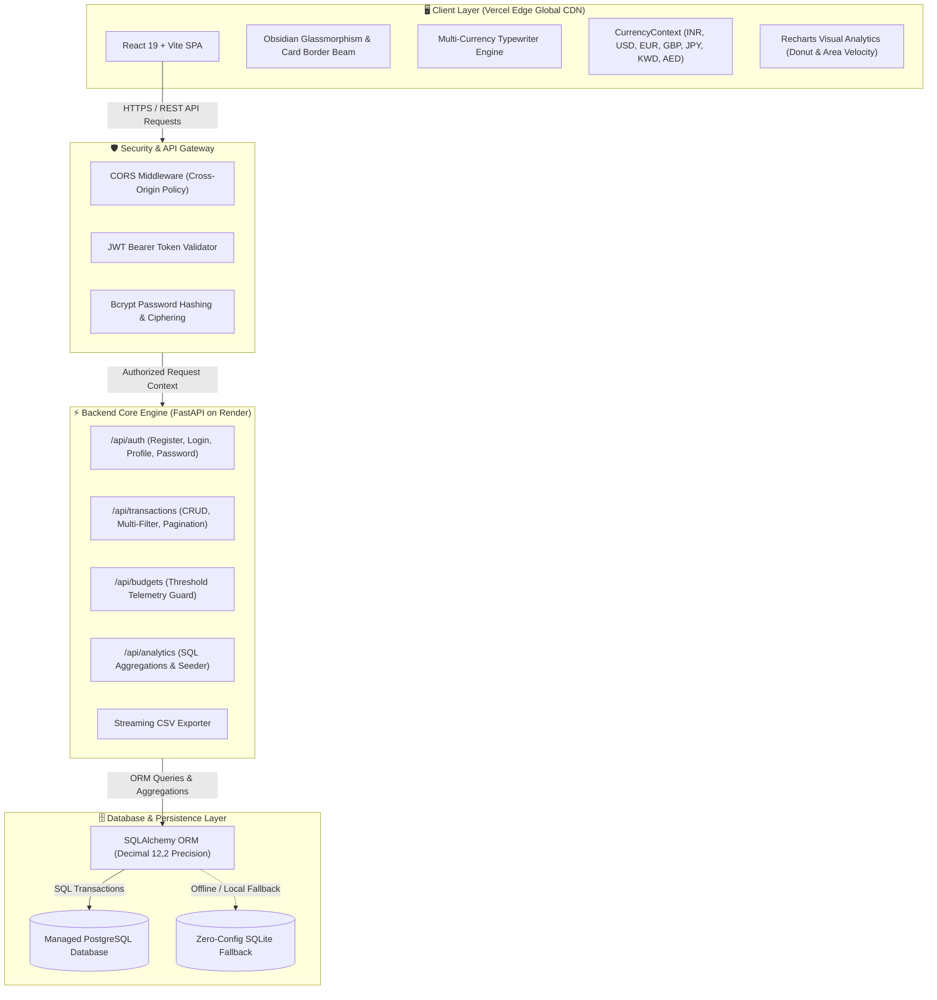

<div align="center">

# 🏛️ WEALTHPULSE
### Institutional Private Wealth & Financial Liquidity Terminal

[](https://wealthpulse-expense-tracker.vercel.app/)
[](https://wealthpulse-api-rbj4.onrender.com/)
[](https://wealthpulse-api-rbj4.onrender.com/docs)
[](LICENSE)

<p align="center">
  A full-stack, enterprise-grade personal finance terminal featuring real-time multi-currency exchange, high-precision SQL aggregations, budget risk telemetry, and auditable CSV ledger streams.
</p>

---

### 🌐 Live Deployments
| Layer | Service | Deployment URL |
| :--- | :--- | :--- |
| **Frontend Client** | **Vercel Edge Network** | [https://wealthpulse-expense-tracker.vercel.app/](https://wealthpulse-expense-tracker.vercel.app/) |
| **Backend REST API** | **Render Cloud** | [https://wealthpulse-api-rbj4.onrender.com/](https://wealthpulse-api-rbj4.onrender.com/) |
| **Interactive API Specs** | **FastAPI Swagger UI** | [https://wealthpulse-api-rbj4.onrender.com/docs](https://wealthpulse-api-rbj4.onrender.com/docs) |

---

</div>

## 🛠️ Technology Stack & Badges

<div align="center">

### Frontend Ecosystem


### Backend & Infrastructure


</div>

---

## 🏗️ System Architecture & Data Flow



---

## ✨ Core Key Features

### 1. 🌍 Dynamic Global Multi-Currency Engine
- Real-time exchange rate conversions and localized number formatting (`Intl.NumberFormat`) across 7 global currencies:
  - 🇮🇳 **INR** (`₹` - Indian Rupee)
  - 🇺🇸 **USD** (`$` - US Dollar)
  - 🇪🇺 **EUR** (`€` - Euro)
  - 🇬🇧 **GBP** (`£` - British Pound)
  - 🇯🇵 **JPY** (`¥` - Japanese Yen, zero-decimal precision)
  - 🇰🇼 **KWD** (`KD` - Kuwaiti Dinar, 3-decimal precision)
  - 🇦🇪 **AED** (`AED` - UAE Dirham)
- Switch currencies anytime via the header pill; charts, stat cards, and ledger rows convert instantaneously.

### 2. 🏛️ Institutional Terminal Aesthetic
- **Obsidian Dark Palette**: High-contrast `#05080c`, `#0a0f16`, and `#0e1622` surfaces accented with Vault Emerald (`#10b981`) and Champagne Gold (`#eab308`).
- **Interactive Card Border Beam**: Moving your cursor across the screen dynamically illuminates the borders and corners of nearby cards with an ambient emerald-gold specular highlight.
- **Precision Typography**: `JetBrains Mono` with tabular numeral alignment (`font-mono-num`), `Space Grotesk` display headings, and `Manrope` body font.

### 3. 📊 Visual Analytics & Macro Cashflow
- **Sector Allocation Donut (`Recharts`)**: Interactive hover slice detection, center summary label, and instant Expense/Income toggle.
- **Cash Flow Velocity Wave (`Recharts`)**: Area gradient vs. monthly bar chart comparison for income vs. outflow trajectory.

### 4. 🚨 Budget Risk Telemetry & Safeguards
- Real-time telemetry monitoring category expenditure limits:
  - 🟢 **Healthy / Safe** (< 80% used)
  - 🟡 **Advisory Warning** (80% – 99% used)
  - 🔴 **Ceiling Exceeded** ($\ge$ 100% with pulsating alert badge)
- Interactive Notification Bell dropdown providing immediate risk breakdown.

### 5. 📑 Treasury Ledger & CSV Export
- Search transactions by memo, note, or recipient entity.
- Multi-filtering by Category, Cashflow Type (Inflow/Outflow), Payment Method (UPI, Credit Card, Debit Card, Net Banking, Cash), and Date Range.
- **1-Click Filtered CSV Export** streamed directly to client storage.

### 6. 🔐 Multi-User Isolation & Security
- Isolated accounts with salted `bcrypt` password hashing and signed `JWT` access tokens.
- **1-Click Demo Evaluation Login** for instant evaluations.
- **Account & Security Modal**: Update display name, view creation timestamps, and change access passwords.

---

## 📡 REST API Reference

| Method | Endpoint | Description | Auth Required |
| :--- | :--- | :--- | :---: |
| `POST` | `/api/auth/register` | Register new user account (with optional 4-month sample ledger) | No |
| `POST` | `/api/auth/login` | Authenticate credentials and receive signed JWT token | No |
| `GET` | `/api/auth/me` | Fetch authenticated user profile & metadata | Yes |
| `PUT` | `/api/auth/profile` | Update account display name | Yes |
| `PUT` | `/api/auth/change-password` | Update account password with verification | Yes |
| `GET` | `/api/transactions` | Query filtered & paginated transaction ledger records | Yes |
| `POST` | `/api/transactions` | Post new transaction to ledger | Yes |
| `PUT` | `/api/transactions/{id}` | Update existing transaction record | Yes |
| `DELETE` | `/api/transactions/{id}` | Purge transaction record from ledger | Yes |
| `GET` | `/api/transactions/export/csv` | Stream filtered transactions as `.csv` file | Yes |
| `GET` | `/api/budgets` | Fetch monthly budget ceilings with active threshold statuses | Yes |
| `POST` | `/api/budgets` | Create or update category monthly ceiling | Yes |
| `DELETE` | `/api/budgets/{id}` | Disengage budget ceiling target | Yes |
| `GET` | `/api/analytics/summary` | Compute net liquidity, monthly inflow, outflow, & savings rate | Yes |
| `GET` | `/api/analytics/categories` | SQL aggregation of category disbursements & percentages | Yes |
| `GET` | `/api/analytics/monthly-trend`| 6-month historical liquidity trajectory | Yes |
| `POST` | `/api/analytics/seed` | Seed 4-month realistic sample transactions and budgets | Yes |

---

## 💻 Local Development Setup

### Prerequisites
- **Node.js** (v18+)
- **Python** (v3.10+)
- **PostgreSQL** (Optional — automatically falls back to SQLite if PostgreSQL is not active)

### 1. Clone the Repository
```bash
git clone https://github.com/nilbanik/Wealthpulse-expense-tracker.git
cd Wealthpulse-expense-tracker
```

### 2. Backend Setup
```bash
cd backend
python -m venv venv
# Windows:
.\venv\Scripts\activate
# Mac/Linux:
source venv/bin/activate

pip install -r requirements.txt
uvicorn main:app --host 0.0.0.0 --port 8000 --reload
```
API will run at `http://localhost:8000` (Docs at `http://localhost:8000/docs`).

### 3. Frontend Setup
```bash
cd ../frontend
npm install
npm run dev
```
Frontend will run at `http://localhost:5173`.

---

## 📄 License
This project is open-source and available under the **MIT License**.
